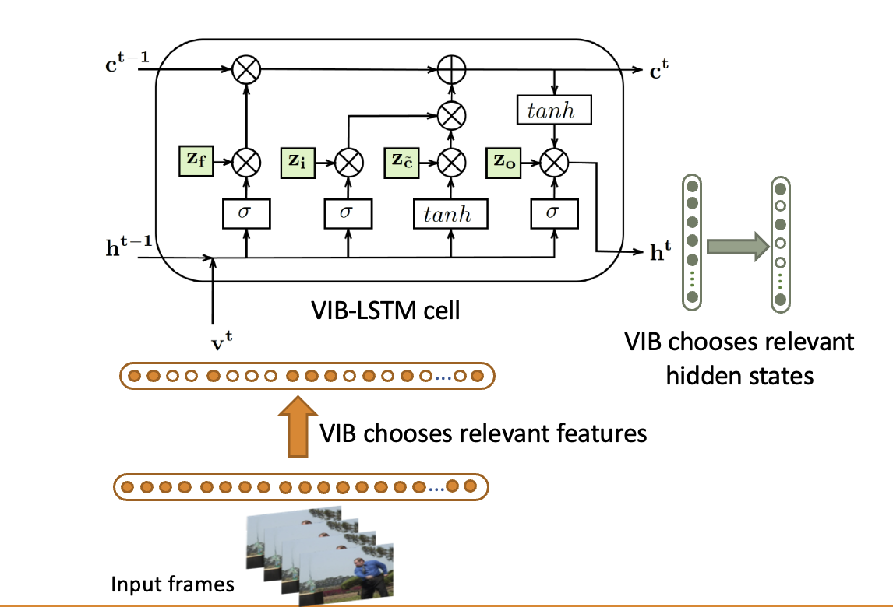
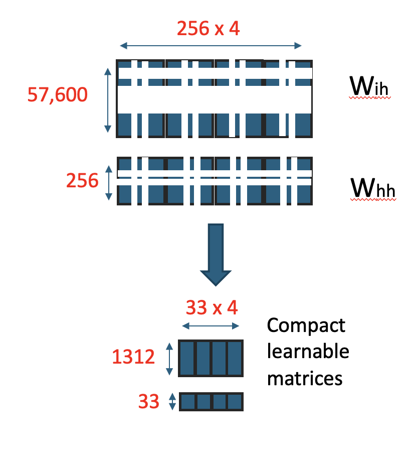
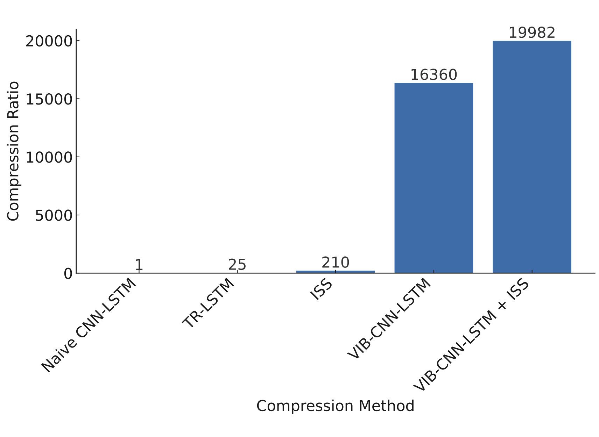
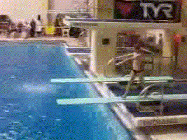

# VIB-LSTM: Compressing Sequential Networks for Action Recognition

<p align="center">
  <a href="https://openaccess.thecvf.com/content/WACV2021/html/Srivastava_A_Variational_Information_Bottleneck_Based_Method_to_Compress_Sequential_Networks_WACV_2021_paper.html"></a>
  <a href="https://arxiv.org/abs/2010.01343"></a>
  
  
</p>

Official implementation of **[A Variational Information Bottleneck Based Method to Compress Sequential Networks for Human Action Recognition](https://openaccess.thecvf.com/content/WACV2021/html/Srivastava_A_Variational_Information_Bottleneck_Based_Method_to_Compress_Sequential_Networks_WACV_2021_paper.html)**, published at **IEEE/CVF WACV 2021**. [[arXiv]](https://arxiv.org/abs/2010.01343)

> **TL;DR:** VIB layers placed inside each LSTM gate learn which hidden dimensions are redundant, compressing sequential networks by up to **16,360×** while maintaining accuracy on standard action recognition benchmarks.

---

## Introduction

Action recognition from video requires both spatial and temporal processing, making CNN-LSTM models large and resource-intensive — often unsuitable for edge deployment. Existing LSTM compression methods (TT-LSTM, BT-LSTM, TR-LSTM) reduce only the input-to-hidden matrix, leaving hidden state redundancy unaddressed. Group-lasso methods target hidden states but ignore the large input dimension. **No prior work compresses both simultaneously.**

This paper proposes a **Variational Information Bottleneck (VIB)**-based pruning approach that places learnable bottleneck variables directly inside each LSTM gate. The model jointly prunes the input feature vector and the hidden state vector in a single end-to-end training pass. VIB layers are removed entirely at inference — only the compact LSTM matrices remain.

<table align="center">
  <tr>
    <td align="center" width="60%">
      
      <br/><em>VIB-LSTM cell: z<sub>i</sub>, z<sub>f</sub>, z<sub>g</sub>, z<sub>o</sub> prune irrelevant input features (bottom) and hidden state dimensions (right) during training.</em>
    </td>
    <td align="center" width="40%">
      
      <br/><em>After pruning (UCF11): W<sub>ih</sub> 57,600 → 1,312 and W<sub>hh</sub> 256 → 33.</em>
    </td>
  </tr>
</table>

### Contributions

1. **Novel VIB-LSTM structure** — trains high-accuracy sparse LSTM models by applying information bottlenecks at every gate (input, forget, cell, output).
2. **Principled sequential compression pipeline** — sparsifies pre-trained RNN/LSTM/GRU weight matrices with minimal hyperparameter tuning.
3. **CNN-LSTM compression framework** — extends VIB to compress the feature input dimension of CNN-LSTM architectures, not just hidden states.
4. **State-of-the-art compression with comparable accuracy** — validated on UCF11, HMDB51, and UCF101; outperforms all prior LSTM compression methods by a large margin.

---

## Table of Contents

- [Key Results](#key-results)
- [Edge Deployment](#edge-deployment-inference-on-raspberry-pi-3)
- [Installation](#installation)
- [Quick Start](#quick-start)
- [Usage](#usage)
- [Notes](#notes)
- [Citation](#citation)


---

## Key Results

### End-to-End LSTM — UCF11

| Method | LSTM Parameters | Compression Ratio | Accuracy |
|---|---|---|---|
| Naïve-LSTM | 59.25M | 1× | 69.7% |
| TT-LSTM | 0.268M | 221× | 79.6% |
| BT-LSTM | 0.268M | 221× | 85.3% |
| TR-LSTM | 0.267M | 221.8× | 86.9% |
| HT-LSTM | 0.266M | 222.7× | 87.9% |
| **VIB-LSTM (Ours)** | **0.178M** | **332×** | **85.4%** |

### CNN-LSTM — UCF11

| Method | Total Params | LSTM Params | Accuracy |
|---|---|---|---|
| Naïve-LSTM | 55.38M | 33.57M | 98.53% |
| TR-LSTM | 23.15M | 1.340M | 93.8% |
| ISS | 21.97M | 0.160M | 94.6% |
| **VIB-LSTM (Ours)** | **21.86M** | **2,052** | **98.53%** |
| VIB-LSTM + ISS | 21.86M | 1,680 | 90.2% |
| EfficientNet + VIB-LSTM | 7.8M | 1,680 | 96.6% |

> VIB-LSTM achieves **16,360× compression** of LSTM parameters over Naïve-CNN-LSTM while maintaining full accuracy — outperforming TR-LSTM (25×) and ISS (210×) by orders of magnitude.

<p align="center">
  
</p>

### HMDB51 and UCF101

| Method | HMDB51 LSTM Params | HMDB51 Acc | UCF101 LSTM Params | UCF101 Acc |
|---|---|---|---|---|
| Naïve-LSTM | 33.57M | 62.9% | 9.44M | 92.6% |
| TR-LSTM | 1.340M | 63.8% | — | — |
| Attention-ConvLSTM | 4.72M | 67.1% | 4.72M | 92.88% |
| **VIB-LSTM (Ours)** | **0.41M** | **64.5%** | **0.46M** | **92.2%** |
| **TS-VIB-LSTM (Ours)** | **0.41M** | **68.16%** | **0.46M** | **93.15%** |

> VIB-LSTM compresses Naïve-LSTM by **81× on HMDB51** and **20× on UCF101**, with accuracy matching or exceeding the uncompressed baseline.

---

## Edge Deployment: Inference on Raspberry Pi 3

The compressed model was benchmarked on a **Raspberry Pi 3 (no parallelism)** on a single UCF11 video, demonstrating real-world edge viability.

| | Uncompressed CNN-LSTM | Compressed CNN-VIB-LSTM |
|---|---|---|
| **LSTM Parameters** | 33.57M | 2,052 |
| **Top-1 Accuracy** | 98.53% | **98.53%** |
| **Inference Time** | 1.26 s | **13 ms** |
| **Speedup** | — | **~100×** |

<table align="center">
  <tr>
    <td align="center">
      
      <br/><em>Uncompressed CNN-LSTM</em>
    </td>
    <td align="center">
      
      <br/><em>Compressed CNN-VIB-LSTM</em>
    </td>
  </tr>
</table>

---

## Installation

**Requirements:** Python 3.6+, PyTorch 1.2+

```bash
pip install -r requirements.txt
```

**Optional — EfficientNet feature extractor:**

```bash
pip install efficientnet_pytorch
# or clone: https://github.com/lukemelas/EfficientNet-PyTorch
```

---

## Quick Start

Full CNN-LSTM compression pipeline on UCF11:

```bash
# 1. Prune a pre-trained model
bash scripts/train_cnn_vib_pretrained.sh UCF11_updated_mpg-frames/ naive_lstm.pth VIB_checkpoint/

# 2. Fine-tune the pruned model
bash scripts/finetune_cnn_vib.sh UCF11_updated_mpg-frames/ VIB_checkpoint/best.pth.tar VIB_finetuned/

# 3. Evaluate
bash scripts/evaluate.sh UCF11_updated_mpg-frames/ VIB_finetuned/best.pth.tar VIB_finetuned/

# 4. Convert to a dense compressed model for deployment
bash scripts/convert_to_dense.sh VIB_finetuned/best.pth.tar UCF11_updated_mpg-frames/
```

See [Usage](#usage) below for all options, flags, and the end-to-end LSTM track.

---

## Usage

### Pipeline Overview

VIB-LSTM compression follows a two-stage pipeline. Choose the track based on your architecture:

| Track | When to use | Scripts |
|---|---|---|
| **CNN-LSTM** | CNN feature extractor + LSTM classifier | `scripts/train_cnn_vib_*.sh` |
| **End-to-End LSTM** | Raw frames fed directly into LSTM (no CNN) | `scripts/train_e2e_vib_*.sh` |

Both tracks follow the same four stages:

```
[1] Train/Prune  →  [2] Fine-tune (optional)  →  [3] Evaluate  →  [4] Convert to dense
```

The key hyperparameter throughout is `--kml` (compression multiplier). Higher values prune more aggressively. Start with `--kml 2` and increase if accuracy holds.

---

### Stage 1 — Train and Prune

**Starting from scratch** (trains a naive LSTM, then applies VIB pruning in one pass):
```bash
# CNN-LSTM track
bash scripts/train_cnn_vib_scratch.sh <dataset_path> <save_dir>

# End-to-end LSTM track
bash scripts/train_e2e_vib_scratch.sh <dataset_path> <save_dir>
```

**Starting from a pre-trained LSTM checkpoint** (recommended — faster convergence, better accuracy at high compression):
```bash
# CNN-LSTM track
bash scripts/train_cnn_vib_pretrained.sh <dataset_path> <path_to_model> <save_dir>

# End-to-end LSTM track
bash scripts/train_e2e_vib_pretrained.sh <dataset_path> <path_to_model> <save_dir>
```

> **Tip:** Use the pretrained path if you have an existing LSTM trained on your dataset. VIB layers initialize around the pre-trained weights, preserving accuracy at higher compression ratios.

**Resuming an interrupted run:**
```bash
bash scripts/resume_cnn_vib.sh <dataset_path> <path_to_checkpoint> <save_dir>
bash scripts/resume_e2e_vib.sh <dataset_path> <path_to_checkpoint> <save_dir>
```

---

### Stage 2 — Fine-tune (Optional)

After pruning, fine-tune with VIB masks frozen to recover any accuracy drop. Recommended when targeting high compression ratios (`--kml > 3`).

```bash
bash scripts/finetune_cnn_vib.sh  <dataset_path> <path_to_pruned_model> <save_dir>
bash scripts/finetune_e2e_vib.sh  <dataset_path> <path_to_pruned_model> <save_dir>
```

---

### Stage 3 — Evaluate

```bash
bash scripts/evaluate.sh <dataset_path> <path_to_checkpoint> <save_dir>
```

> Adjust `--img_dim1` / `--img_dim2` in [scripts/evaluate.sh](scripts/evaluate.sh) to match your model's input size (299×299 for InceptionNet-v3, 160×120 for end-to-end).

---

### Stage 4 — Convert to Dense-Compressed Model

Strips the VIB layers and materializes the pruned weight matrices into a smaller, deployment-ready model with no runtime overhead.

```bash
bash scripts/convert_to_dense.sh <path_to_VIB_model> <dataset_path>
```

Output is saved to `CompressedIBmodels/`. This is the model used for the edge deployment benchmarks (Raspberry Pi 3, ~13 ms inference).

---

---

## Notes

- **Dataset loader:** `datasetucf11.py` may need adjustments for your dataset folder structure. `--dataset_path` accepts the path to the dataset root (e.g., `UCF11_updated_mg-frames` for UCF11).
- **Compression factor:** `--kml` sets the compression factor multiplier. It is kept flexible per layer and can be modified in `model_VIBLSTM.py`.
- **Selective pruning:** VIB pruning can be done in steps:
  - To prune only the LSTM input / feature dimension: set `masking=True` in `ib0`, `ib1`, `ib2`, `ib3` inside `model_VIBLSTM.py`.
  - To prune only the hidden state dimension: set `masking=True` in `ib4` inside `model_VIBLSTM.py`.

---

## Citation

If you use this code, please cite:

```bibtex
@inproceedings{srivastava2021variational,
  title={A variational information bottleneck based method to compress sequential networks for human action recognition},
  author={Srivastava, Ayush and Dutta, Oshin and Gupta, Jigyasa and Agarwal, Sumeet and AP, Prathosh},
  booktitle={Proceedings of the IEEE/CVF Winter Conference on Applications of Computer Vision},
  pages={2745--2754},
  year={2021}
}
```

---

## Author & Contact

**Oshin Dutta**
- LinkedIn: [https://www.linkedin.com/in/oshindutta/](https://www.linkedin.com/in/oshindutta/)
- Email: [oshind.phd@gmail.com](mailto:oshind.phd@gmail.com)
